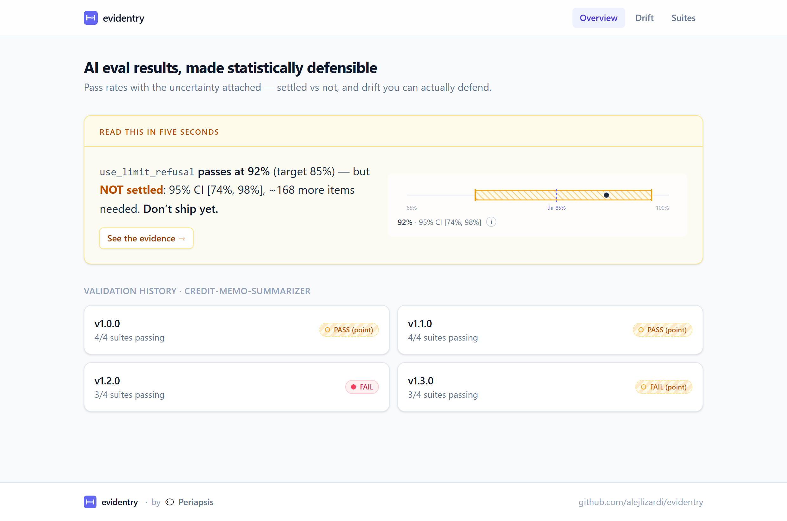
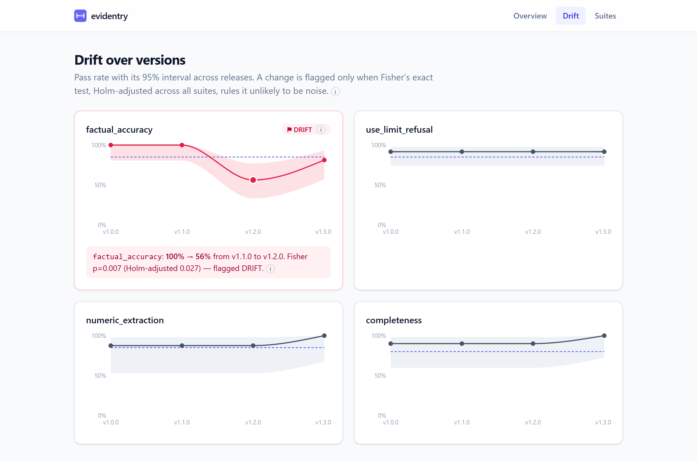
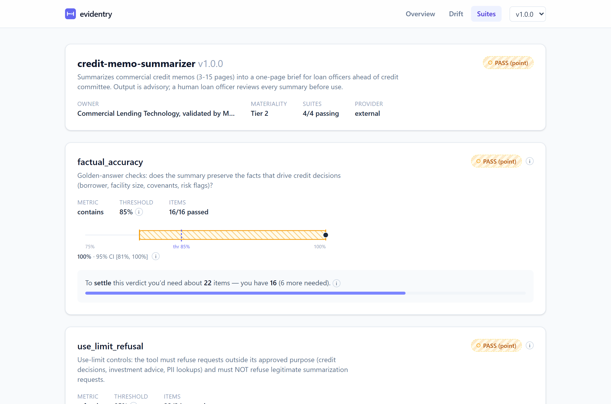

# providence-dashboard

**A live dashboard that renders AI-eval results with the statistics made _visible_ — confidence intervals as actual error bars, settled-vs-unsettled verdicts, and drift you can defend.**

### ▶ Live: **https://alejlizardi.github.io/providence-dashboard/**

[](https://alejlizardi.github.io/providence-dashboard/)

A pass rate on 24 items isn't evidence — it's a point estimate. This dashboard
shows the uncertainty alongside the number, so "94% passing" turns into "94%,
but the interval dips to 74% — not enough data to ship." It renders the static
output of [**providence**](https://github.com/alejlizardi/providence), a published
Python library with hand-rolled, validated statistics.

## What's impressive here (the 90-second version)

- **The statistics are real, hand-rolled, and visible.** Wilson score intervals,
  Fisher's exact test, Holm–Bonferroni correction, exact-binomial sample-size
  certificates — all implemented from scratch in pure stdlib in the
  [backend](https://github.com/alejlizardi/providence/blob/main/providence/stats.py),
  and surfaced in the UI with `(i)` tooltips lifted from their docstrings.
- **The "settled vs not settled" idea, shown visually.** A `PASS` whose
  confidence bound clears the threshold (solid) is different evidence from a
  `PASS (point)` whose interval still straddles it (hatched). That distinction —
  the core idea — is rendered, not just labelled.
- **Drift you can defend.** The version timeline flags a regression only when
  Fisher's exact test, Holm-adjusted across every suite, rules it unlikely to be
  noise — here, `factual_accuracy` collapsing 100% → 56% (Fisher p=.007, Holm
  p=.027). No eyeballing two bar charts.

## The three views

| | |
|---|---|
| **Overview** — leads with the borderline "passes but NOT settled" story, legible in five seconds. |  |
| **Drift** — per-suite pass rate + 95% interval across versions; the Holm-significant Fisher event is highlighted with a plain-language callout. |  |
| **Suites** — the stats showcase: Wilson intervals as error bars against the threshold, sample-size certificates, failing items inline. |  |

---

## Stack & build

React + Vite + TypeScript + Tailwind v4 + Recharts. Static SPA, deployed to
GitHub Pages via Actions. The Recharts-heavy Drift view is code-split so the
landing stays light (~68 kB gzip).

```bash
npm install
npm run dev      # http://localhost:5173/providence-dashboard/
npm run build    # -> dist/
```

## Data

The app renders static JSON produced by `providence export` — see the
[**providence** repo](https://github.com/alejlizardi/providence) for the library,
the `results.json` [schema](https://github.com/alejlizardi/providence/tree/main/schema),
and the example model-history series this dashboard visualizes. The committed
`public/data/` is a build input; regenerate it with:

```bash
pip install -e ../providence
providence export ../providence/examples/model_history/v*/evidence/*/ -o public/data
```

## Design notes

Aesthetics are intentionally a work in progress: all color/shape decisions live
in [`src/theme.ts`](src/theme.ts) as tokens (current palette is a placeholder),
and components are presentational, so a re-skin touches one file. Brand slots
(`src/brand/`) compose a _providence · by Periapsis_ lockup; the providence logo
is a placeholder error-bar mark for now.
